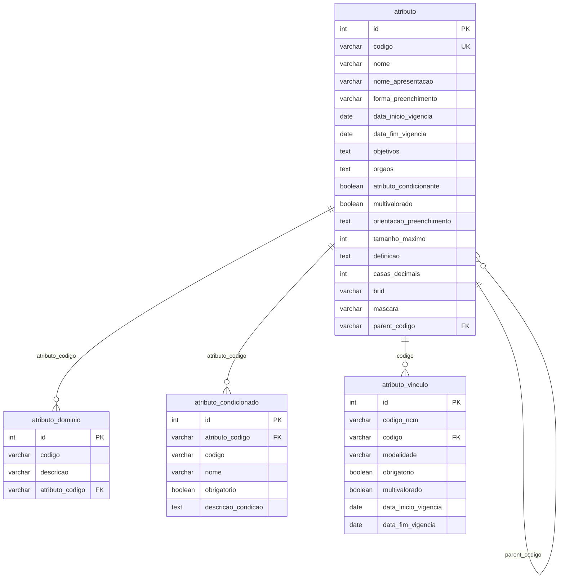
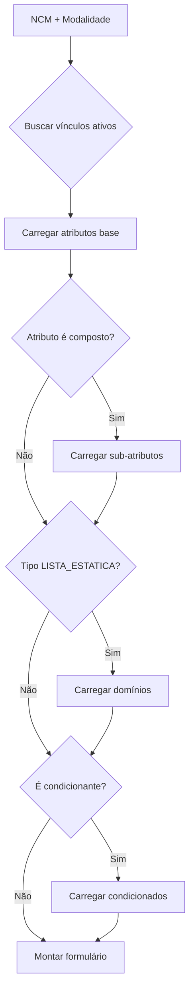
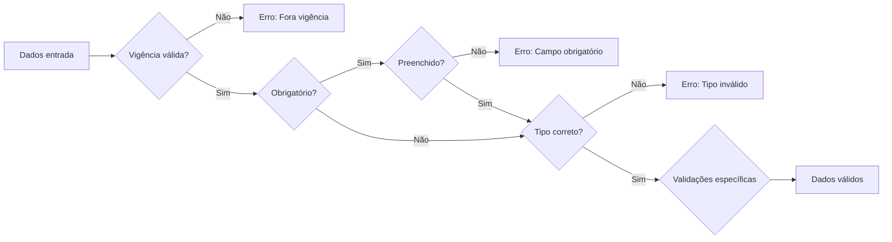

# Sistema de Atributos Dinâmicos - Documentação Técnica

## 1. Visão Geral

O Sistema de Atributos Dinâmicos é uma implementação do padrão **EAV (Entity-Attribute-Value)** adaptado para o contexto de comércio exterior. Ele permite a definição e gestão de características personalizadas para produtos/mercadorias baseados em seus códigos NCM (Nomenclatura Comum do Mercosul), sem necessidade de alterações estruturais no banco de dados.

### 1.1 Principais Características

- **Flexibilidade Total**: Criação de novos atributos sem mudanças no schema do banco
- **Versionamento Temporal**: Controle completo de vigências e histórico
- **Hierarquia e Composição**: Suporte a atributos compostos e estruturas aninhadas
- **Regras Condicionais**: Atributos que aparecem baseados em condições específicas
- **Multi-modalidade**: Diferentes regras por tipo de operação (importação/exportação)
- **Validação Dinâmica**: Regras de obrigatoriedade e validação configuráveis

## 2. Estrutura do Banco de Dados

### 2.1 Diagrama de Relacionamento



### 2.2 Importação da Estrutura Legada

Os arquivos desta pasta permitem recriar e popular o banco de dados legado. Utilize o script `DDL_ATRIBUTOS.SQL` para gerar as tabelas e o `generate_atributo_inserts.py` juntamente com `exemplo_atributo.json` para produzir os `INSERTs` correspondentes.

## 3. Detalhamento das Tabelas

### 3.1 Tabela `atributo` - Definição Principal

Esta é a tabela central que define todos os atributos disponíveis no sistema.

#### 3.1.1 Campos de Identificação e Apresentação

| Campo | Tipo | Descrição |
|-------|------|-----------|
| `id` | int | Identificador único auto-incremental |
| `codigo` | varchar(50) | Código único de negócio do atributo |
| `nome` | varchar(255) | Nome técnico interno do atributo |
| `nome_apresentacao` | varchar(255) | Nome amigável exibido aos usuários |
| `brid` | varchar(50) | Identificador externo para integração |

#### 3.1.2 Tipo de Preenchimento (`forma_preenchimento`)

Define como o atributo será preenchido pelo usuário:

| Tipo | Descrição | Campos Aplicáveis |
|------|-----------|-------------------|
| `LISTA_ESTATICA` | Seleção de valores pré-definidos | - |
| `BOOLEANO` | Checkbox Sim/Não | - |
| `TEXTO` | Campo de texto livre | `tamanho_maximo`, `mascara` |
| `NUMERO_REAL` | Números decimais | `casas_decimais`, `tamanho_maximo` |
| `NUMERO_INTEIRO` | Números inteiros | `tamanho_maximo` |
| `COMPOSTO` | Container para outros atributos | `parent_codigo` |

#### 3.1.3 Características Especiais por Tipo

**Para `TEXTO`:**
- `tamanho_maximo`: Limite de caracteres (ex: 255)
- `mascara`: Padrão de formatação (ex: "##.###-###" para CEP)

**Para `NUMERO_REAL`:**
- `casas_decimais`: Quantidade de casas após a vírgula (ex: 2 para valores monetários)
- `tamanho_maximo`: Quantidade máxima de dígitos totais

**Para `NUMERO_INTEIRO`:**
- `tamanho_maximo`: Quantidade máxima de dígitos

**Para `COMPOSTO`:**
- Utiliza `parent_codigo` para criar hierarquias
- Não possui valor próprio, apenas agrupa outros atributos

#### 3.1.4 Campos de Controle

| Campo | Tipo | Descrição | Aplicável a |
|-------|------|-----------|-------------|
| `multivalorado` | boolean | Permite múltiplos valores | Todos exceto `BOOLEANO` |
| `atributo_condicionante` | boolean | Se true, pode condicionar outros atributos | Principalmente `BOOLEANO` e `LISTA_ESTATICA` |
| `data_inicio_vigencia` | date | Início da validade do atributo | Todos |
| `data_fim_vigencia` | date | Fim da validade do atributo | Todos |

#### 3.1.5 Campos Informativos

| Campo | Tipo | Descrição |
|-------|------|-----------|
| `orientacao_preenchimento` | text | Instruções para o usuário |
| `definicao` | text | Definição técnica/legal do atributo |
| `objetivos` | text | Finalidade do atributo |
| `orgaos` | text | Órgãos reguladores relacionados |

### 3.2 Tabela `atributo_condicionado` - Regras Condicionais

Define atributos que só aparecem quando condições específicas são atendidas.

#### 3.2.1 Funcionamento

1. O campo `atributo_codigo` referencia o atributo condicionante (pai)
2. `descricao_condicao` define a regra (ex: "Quando valor = 'SIM'")
3. O atributo condicionado herda a maioria das características do atributo base
4. `obrigatorio` define se é mandatório quando a condição é satisfeita

#### 3.2.2 Exemplo Prático

```
Atributo Condicionante: "possui_bateria" (BOOLEANO)
↓
Quando valor = true
↓
Atributos Condicionados:
- "tipo_bateria" (LISTA_ESTATICA) - obrigatório
- "capacidade_bateria_mah" (NUMERO_INTEIRO) - obrigatório
- "bateria_removivel" (BOOLEANO) - opcional
```

### 3.3 Tabela `atributo_dominio` - Valores de Lista

Define os valores possíveis para atributos do tipo `LISTA_ESTATICA`.

#### 3.3.1 Estrutura

| Campo | Descrição | Exemplo |
|-------|-----------|---------|
| `codigo` | Valor armazenado | "BR", "US", "CN" |
| `descricao` | Texto exibido | "Brasil", "Estados Unidos", "China" |
| `atributo_codigo` | Vínculo com atributo pai | "pais_origem" |

#### 3.3.2 Características

- Suporta Unicode para descrições internacionais
- Permite ordenação customizada via `id`
- Valores podem ser reutilizados entre diferentes períodos de vigência

### 3.4 Tabela `atributo_vinculo` - Associação NCM

Conecta atributos a códigos NCM específicos com regras de aplicação.

#### 3.4.1 Campos Principais

| Campo | Descrição | Exemplo |
|-------|-----------|---------|
| `codigo_ncm` | NCM de 8 dígitos | "84713012" |
| `codigo` | Código do atributo | "memoria_ram" |
| `modalidade` | Tipo de operação | "IMPORTACAO", "EXPORTACAO" |
| `obrigatorio` | Obrigatoriedade para o NCM | true/false |
| `multivalorado` | Override do comportamento padrão | true/false |

#### 3.4.2 Vigência Específica

- Permite diferentes períodos de vigência por NCM
- Útil para mudanças regulatórias graduais
- Sobrescreve a vigência do atributo base quando definida

## 4. Fluxos de Dados

### 4.1 Fluxo de Carregamento de Atributos



### 4.2 Fluxo de Validação



## 5. Casos de Uso Detalhados

### 5.1 Caso: Importação de Eletrônicos

**NCM**: 85171231 - Telefones celulares

**Atributos Configurados**:

1. **especificacoes_tecnicas** (COMPOSTO)
   - **sistema_operacional** (LISTA_ESTATICA)
     - Domínios: "Android", "iOS", "Outro"
   - **memoria_interna_gb** (NUMERO_INTEIRO)
     - Obrigatório, tamanho_maximo: 4
   - **suporta_5g** (BOOLEANO)
     - Condicionante

2. **Atributos Condicionados** (quando suporta_5g = true):
   - **bandas_5g_suportadas** (TEXTO)
     - Obrigatório, multivalorado
   - **certificacao_anatel_5g** (TEXTO)
     - Obrigatório, mascara: "####/##-##"

### 5.2 Caso: Produtos Químicos

**NCM**: 38089419 - Inseticidas

**Atributos com Vigência Temporal**:

1. **registro_anvisa** (TEXTO)
   - Vigência: 01/01/2020 a 31/12/2024
   - Substituído por **registro_novo_formato** a partir de 01/01/2025

2. **composicao_quimica** (COMPOSTO)
   - **ingrediente_ativo** (LISTA_ESTATICA)
     - Multivalorado: true
   - **concentracao_percentual** (NUMERO_REAL)
     - casas_decimais: 2

## 6. Boas Práticas de Implementação

### 6.1 Performance

1. **Índices Recomendados**:
   ```sql
   CREATE INDEX idx_atributo_codigo ON atributo(codigo);
   CREATE INDEX idx_atributo_parent ON atributo(parent_codigo);
   CREATE INDEX idx_vinculo_ncm ON atributo_vinculo(codigo_ncm, modalidade);
   CREATE INDEX idx_dominio_atributo ON atributo_dominio(atributo_codigo);
   ```

2. **Cache de Configurações**:
   - Cachear estruturas de atributos por NCM
   - Invalidar cache apenas em mudanças de vigência

### 6.2 Integridade de Dados

1. **Validações em Aplicação**:
   - Verificar ciclos em atributos compostos
   - Garantir que condicionantes sejam do tipo adequado
   - Validar máscaras antes de salvar

2. **Constraints Adicionais**:
   ```sql
   ALTER TABLE atributo 
   ADD CONSTRAINT chk_vigencia 
   CHECK (data_fim_vigencia IS NULL OR data_fim_vigencia >= data_inicio_vigencia);
   ```

### 6.3 Evolução do Sistema

1. **Versionamento de Atributos**:
   - Nunca deletar atributos, apenas marcar fim de vigência
   - Manter histórico completo para auditoria

2. **Migração de Dados**:
   - Criar novos atributos com vigência futura
   - Mapear dados antigos gradualmente

## 7. Considerações de Segurança

### 7.1 Controle de Acesso

- Implementar permissões por órgão (`orgaos`)
- Logs de auditoria para mudanças em atributos
- Validação de dados de entrada contra XSS/SQL Injection

### 7.2 Integridade Referencial

- Não permitir exclusão de atributos com vínculos ativos
- Verificar dependências antes de alterar estruturas

## 8. Integração com Sistemas Externos

### 8.1 APIs de Consulta

```javascript
// Exemplo de endpoint para buscar atributos
GET /api/ncm/{codigo}/atributos?modalidade=IMPORTACAO&data=2025-06-15

// Resposta estruturada
{
  "ncm": "84713012",
  "atributos": [
    {
      "codigo": "memoria_ram",
      "nome_apresentacao": "Memória RAM (GB)",
      "tipo": "NUMERO_INTEIRO",
      "obrigatorio": true,
      "validacoes": {
        "tamanho_maximo": 3
      }
    }
  ]
}
```

### 8.2 Webhook de Notificações

- Notificar sistemas dependentes sobre mudanças de vigência
- Alertar sobre novos atributos obrigatórios

## 9. Métricas e Monitoramento

### 9.1 KPIs Sugeridos

- Taxa de preenchimento de atributos obrigatórios
- Tempo médio de carregamento de formulários
- Quantidade de atributos por NCM
- Frequência de uso de atributos condicionados

### 9.2 Alertas

- Atributos próximos ao fim de vigência
- NCMs sem atributos obrigatórios configurados
- Inconsistências em hierarquias de atributos

## 10. Glossário

| Termo | Definição |
|-------|-----------|
| **NCM** | Nomenclatura Comum do Mercosul - Sistema de classificação de mercadorias |
| **EAV** | Entity-Attribute-Value - Padrão de modelagem para dados dinâmicos |
| **Modalidade** | Tipo de operação comercial (importação, exportação, etc.) |
| **Vigência** | Período de validade de um atributo ou configuração |
| **Domínio** | Conjunto de valores válidos para um atributo de lista |
| **Atributo Condicionante** | Atributo cujo valor determina a exibição de outros |
| **Multivalorado** | Atributo que aceita múltiplas entradas do mesmo tipo |