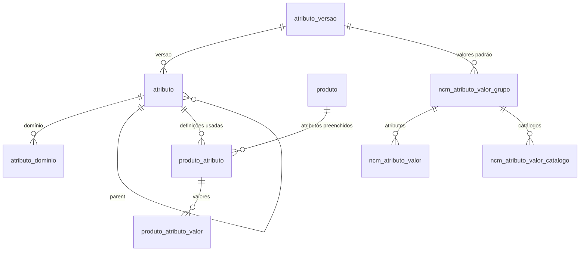
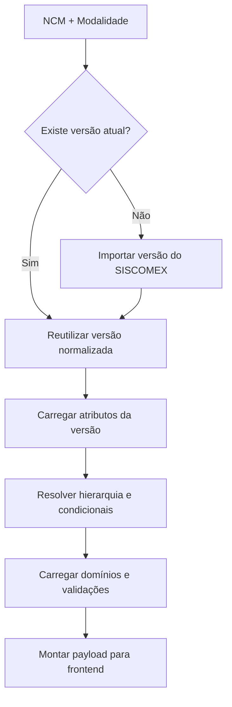
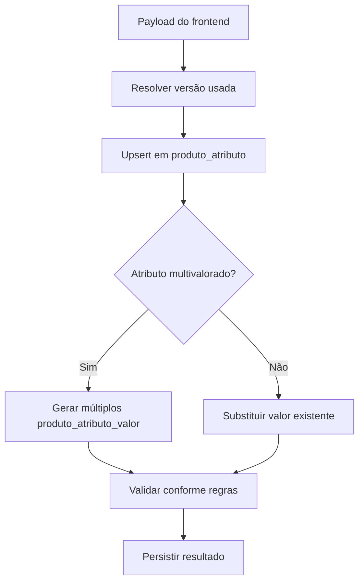

# Sistema de Atributos Dinâmicos - Documentação Técnica

## 1. Visão Geral

O Sistema de Atributos Dinâmicos segue o padrão **EAV (Entity-Attribute-Value)**, agora normalizado para permitir o versionamento e o reaproveitamento de catálogos completos de atributos. A modelagem introduz um catálogo compartilhado de atributos por NCM/modalidade, mantendo a flexibilidade para definir condicionais, domínios e diferentes formatos de preenchimento sem alterar tabelas transacionais.

### 1.1 Principais Características

- **Catálogo versionado**: cada conjunto de atributos para um NCM/modalidade é persistido em `atributo_versao` e pode ser reutilizado por múltiplos produtos ou catálogos de valores padrão.
- **Domínios normalizados**: valores de lista são armazenados em `atributo_dominio`, reutilizáveis por versões posteriores do mesmo atributo.
- **Suporte a multivalorados**: a tabela `produto_atributo_valor` permite múltiplas entradas para um mesmo atributo ou valor padrão.
- **Regras condicionais e hierarquia**: atributos podem depender de outros via `parent_id` e `condicao_json` sem duplicar registros.
- **Separação entre catálogo e preenchimento**: produtos e valores padrão de NCM referenciam a versão ativa do catálogo, garantindo coerência.

## 2. Estrutura do Banco de Dados

### 2.1 Diagrama de Relacionamento



### 2.2 Principais Entidades

- **`atributo_versao`**: identifica o catálogo normalizado (NCM, modalidade e versão).
- **`atributo`**: definição de cada campo disponível em uma versão, incluindo hierarquia, condicional e validações.
- **`atributo_dominio`**: valores de domínio associados a atributos de listas.
- **`produto_atributo` / `produto_atributo_valor`**: armazenamento dos valores preenchidos em produtos, com referência ao atributo e à versão usada no momento da criação.
- **`ncm_atributo_valor_grupo` / `ncm_atributo_valor` / `ncm_atributo_valor_catalogo`**: estrutura para valores padrão reutilizáveis por catálogos e superusuários.

## 3. Detalhamento das Tabelas

### 3.1 `atributo_versao` – Catálogo Normalizado

| Campo | Tipo | Descrição |
|-------|------|-----------|
| `id` | int | Identificador único da versão |
| `ncm_codigo` | varchar(8) | NCM do catálogo |
| `modalidade` | varchar(20) | Modalidade (IMPORTACAO, EXPORTACAO, etc.) |
| `versao` | int | Número sequencial controlado pelo SISCOMEX |
| `criado_em` | datetime | Controle de auditoria |

Cada produto aponta para a versão utilizada ao ser criado (`versao_atributo_id`). Novas versões não invalidam registros anteriores.

### 3.2 `atributo` – Definição do Campo

| Campo | Tipo | Descrição |
|-------|------|-----------|
| `id` | int | Identificador do atributo na versão |
| `versao_id` | int | Referência ao catálogo (`atributo_versao`) |
| `codigo` | varchar | Código de negócio recebido do SISCOMEX |
| `nome` | varchar | Nome técnico |
| `tipo` | varchar | Tipo lógico (TEXTO, NUMERO_INTEIRO, LISTA_ESTATICA, etc.) |
| `obrigatorio` | boolean | Indica obrigatoriedade padrão |
| `multivalorado` | boolean | Permite múltiplos valores |
| `orientacao_preenchimento` | text | Instruções ao usuário |
| `validacoes_json` | json | Configuração específica (tamanho, máscaras, limites) |
| `descricao_condicao` | text | Texto amigável para regras condicionais |
| `condicao_json` | json | Expressão condicional (operadores, comparações, etc.) |
| `parent_id` | int | Relaciona atributos compostos/agrupadores |
| `parent_codigo` | varchar | Código do atributo pai para rastreabilidade |
| `condicionante_codigo` | varchar | Código do atributo condicionante |
| `ordem` | int | Ordenação dentro do formulário |

A hierarquia é resolvida por `parent_id` e `parent_codigo`. Condicionais utilizam `condicao_json` apontando para valores do atributo condicionante.

### 3.3 `atributo_dominio` – Valores de Lista

| Campo | Tipo | Descrição |
|-------|------|-----------|
| `id` | int | Identificador do valor |
| `atributo_id` | int | Referência ao atributo |
| `codigo` | varchar | Valor armazenado |
| `descricao` | varchar | Texto exibido |
| `ordem` | int | Ordenação dentro do domínio |

Domínios são persistidos por versão, permitindo coexistência de conjuntos distintos para o mesmo atributo em versões futuras.

### 3.4 `produto_atributo` e `produto_atributo_valor`

| Campo | Tipo | Descrição |
|-------|------|-----------|
| `produto_atributo.id` | int | Identificador do vínculo |
| `produto_atributo.produto_id` | int | Produto relacionado |
| `produto_atributo.atributo_id` | int | Atributo definido na versão |
| `produto_atributo.atributo_versao_id` | int | Versão utilizada |
| `produto_atributo.validado_em` | datetime | Timestamp da última validação |
| `produto_atributo.erros_validacao` | json | Erros associados |
| `produto_atributo_valor.valor_json` | json | Valor preenchido (inclui tipos primitivos e objetos) |
| `produto_atributo_valor.ordem` | int | Ordem para atributos multivalorados |

A separação permite múltiplos valores por atributo (`ordem`) e mantém as regras de validação próximas ao preenchimento.

### 3.5 Valores Padrão de NCM (`ncm_atributo_*`)

| Tabela | Finalidade |
|--------|------------|
| `ncm_atributo_valor_grupo` | Agrupa valores padrão por superusuário, NCM, modalidade e versão de atributo |
| `ncm_atributo_valor` | Armazena cada valor associado a um atributo específico, seguindo o mesmo formato JSON dos produtos |
| `ncm_atributo_valor_catalogo` | Associa grupos de valores padrão a catálogos específicos |

Os grupos reaproveitam a definição do catálogo (`atributo_versao_id`), mantendo consistência com os produtos publicados.

## 4. Fluxos de Dados

### 4.1 Carregamento do Catálogo



### 4.2 Persistência de Produtos



Valores padrão de NCM seguem o mesmo fluxo, trocando `produto` por `ncm_atributo_valor_grupo`.

## 5. Casos de Uso Detalhados

### 5.1 Produtos Eletrônicos

1. O SISCOMEX envia a versão `12` para o NCM `85171231` (modalidade `IMPORTACAO`).
2. `atributo_versao` persiste o catálogo; `atributo` recebe registros como `especificacoes_tecnicas`, `sistema_operacional`, etc.
3. Ao criar um produto, `produto_atributo` referencia a versão `12`, garantindo que futuras alterações (ex.: versão `13`) não afetem os registros já salvos.
4. Se o atributo `suporta_5g` for verdadeiro, os valores condicionais são resolvidos conforme `condicao_json` antes de persistir em `produto_atributo_valor`.

### 5.2 Valores Padrão Customizados

1. Um superusuário gera um novo grupo de valores padrão para o mesmo NCM/modalidade.
2. `ncm_atributo_valor_grupo` referencia a versão ativa e associa valores através de `ncm_atributo_valor`.
3. Catálogos específicos reutilizam o grupo via `ncm_atributo_valor_catalogo`, garantindo consistência sem duplicação de dados.

## 6. Boas Práticas de Implementação

### 6.1 Performance

- Indexar as chaves estrangeiras principais:
  ```sql
  CREATE INDEX idx_atributo_versao ON atributo(versao_id);
  CREATE INDEX idx_atributo_parent ON atributo(parent_id);
  CREATE INDEX idx_produto_atributo_produto ON produto_atributo(produto_id);
  CREATE INDEX idx_produto_atributo_versao ON produto_atributo(atributo_versao_id);
  CREATE INDEX idx_ncm_valor_grupo ON ncm_atributo_valor_grupo(ncm_codigo, modalidade);
  ```
- Cachear as versões já importadas para evitar recomputar condicionais e hierarquia a cada requisição.

### 6.2 Integridade de Dados

- Garantir que `condicao_json` referencia atributos existentes na mesma versão.
- Bloquear exclusão de versões utilizadas por produtos ou grupos de valores padrão.
- Utilizar transações ao atualizar valores multivalorados para preservar a ordem (`ordem`).

### 6.3 Evolução

- Criar novas versões (`atributo_versao`) ao receber atualizações do SISCOMEX.
- Reprocessar produtos apenas quando necessário; os registros antigos permanecem válidos ao manter a referência da versão utilizada.

## 7. Considerações de Segurança

- Controlar acesso a cadastros de atributos por perfil de usuário.
- Auditar alterações em versões de atributos e em valores padrão.
- Validar o JSON recebido do frontend antes de persistir em `valor_json` para evitar dados inválidos.

## 8. Integração com Sistemas Externos

### 8.1 API de Consulta

```http
GET /api/v1/produtos/{id}/atributos
```

Resposta resumida:

```json
{
  "versao": 12,
  "atributos": [
    {
      "codigo": "memoria_ram",
      "tipo": "NUMERO_INTEIRO",
      "multivalorado": false,
      "valores": [
        { "valor": 8 }
      ]
    }
  ]
}
```

### 8.2 API de Valores Padrão

```http
GET /api/v1/ncm/85171231/valores-padrao?modalidade=IMPORTACAO
```

Retorna os grupos cadastrados, cada um apontando para `atributo_versao` e contendo a mesma estrutura de valores dos produtos.

## 9. Métricas e Monitoramento

- Quantidade de versões por NCM/modalidade.
- Tempo médio para sincronizar novas versões do SISCOMEX.
- Percentual de produtos que utilizam atributos multivalorados.
- Erros de validação por atributo (monitorar `erros_validacao`).

## 10. Glossário

| Termo | Definição |
|-------|-----------|
| **Catálogo Normalizado** | Conjunto de atributos versionados reutilizável por produtos e valores padrão |
| **Versão de Atributo** | Identificador numérico que agrupa os atributos de um NCM/modalidade |
| **Valor Multivalorado** | Entrada adicional em `produto_atributo_valor` para atributos que aceitam múltiplos itens |
| **Grupo de Valores Padrão** | Configuração de referência aplicada a catálogos específicos |
