# Manual de Implementação - Cliente de Atributos Dinâmicos

## Sumário

1. [Visão Geral](#1-visão-geral)
2. [Arquitetura da Aplicação](#2-arquitetura-da-aplicação)
3. [Configuração Inicial](#3-configuração-inicial)
4. [Implementação do Backend](#4-implementação-do-backend)
5. [Sincronização com Servidor](#5-sincronização-com-servidor)
6. [Interface de Usuário](#6-interface-de-usuário)
7. [Fluxo de Cadastro de Produtos](#7-fluxo-de-cadastro-de-produtos)
8. [Validações e Regras de Negócio](#8-validações-e-regras-de-negócio)
9. [Tratamento de Erros](#9-tratamento-de-erros)
10. [Testes](#10-testes)
11. [Deploy e Monitoramento](#11-deploy-e-monitoramento)
12. [Troubleshooting](#12-troubleshooting)

---

## 1. Visão Geral

### 1.1 Objetivo
Implementar uma aplicação cliente que consome estruturas de atributos dinâmicos de um servidor, permitindo o cadastro e edição de produtos com características configuráveis baseadas em NCM.

### 1.2 Principais Funcionalidades
- Cache local de NCMs e estruturas de atributos
- Renderização dinâmica de formulários
- Validação client-side e server-side
- Gestão de mudanças de estrutura
- Sincronização inteligente

### 1.3 Stack Tecnológica Recomendada
- **Backend**: Node.js + Express / Java Spring Boot / Python FastAPI
- **Frontend**: React + TypeScript / Vue.js / Angular
- **Banco de Dados**: MySQL 5.7+ / PostgreSQL
- **Cache**: Redis (opcional)
- **Comunicação**: REST API / GraphQL

---

## 2. Arquitetura da Aplicação

### 2.1 Diagrama de Arquitetura

```mermaid
graph TB
    subgraph "Cliente"
        UI[Interface de Usuário]
        CTRL[Controllers/Services]
        CACHE[Cache Service]
        DB[(Banco Local)]
        SYNC[Sync Service]
        VAL[Validation Service]
    end
    
    subgraph "Servidor"
        API[API de Atributos]
        SERV_DB[(Banco Servidor)]
    end
    
    UI --> CTRL
    CTRL --> CACHE
    CTRL --> VAL
    CACHE --> DB
    SYNC --> API
    SYNC --> CACHE
    API --> SERV_DB
```



### 2.2 Estrutura de Diretórios

```
cliente-atributos/
├── src/
│   ├── api/
│   │   ├── atributos.api.ts
│   │   └── produtos.api.ts
│   ├── services/
│   │   ├── cache.service.ts
│   │   ├── sync.service.ts
│   │   ├── validation.service.ts
│   │   └── produto.service.ts
│   ├── models/
│   │   ├── ncm.model.ts
│   │   ├── atributo.model.ts
│   │   └── produto.model.ts
│   ├── components/
│   │   ├── FormularioDinamico/
│   │   ├── CampoDinamico/
│   │   └── AlertaEstrutura/
│   ├── utils/
│   │   ├── json.utils.ts
│   │   └── date.utils.ts
│   └── config/
│       └── database.config.ts
├── tests/
├── docs/
└── docker/
```

---

## 3. Configuração Inicial

### 3.1 Variáveis de Ambiente

```bash
# .env
# API do Servidor
API_BASE_URL=https://api.servidor.com/v1
API_KEY=sua_chave_api
API_TIMEOUT=30000

# Banco de Dados Local
DB_HOST=localhost
DB_PORT=3306
DB_NAME=cliente_atributos
DB_USER=usuario
DB_PASSWORD=senha

# Cache
CACHE_TTL_HORAS=24
CACHE_MAX_REGISTROS=1000

# Sync
SYNC_INTERVALO_MINUTOS=60
SYNC_BATCH_SIZE=50

# Aplicação
NODE_ENV=production
LOG_LEVEL=info
```

### 3.2 Configuração do Banco de Dados

```javascript
// config/database.config.js
const mysql = require('mysql2/promise');

const dbConfig = {
  host: process.env.DB_HOST,
  port: process.env.DB_PORT,
  database: process.env.DB_NAME,
  user: process.env.DB_USER,
  password: process.env.DB_PASSWORD,
  waitForConnections: true,
  connectionLimit: 10,
  queueLimit: 0,
  enableKeepAlive: true,
  keepAliveInitialDelay: 0
};

const pool = mysql.createPool(dbConfig);

// Testar conexão
async function testConnection() {
  try {
    const connection = await pool.getConnection();
    await connection.ping();
    connection.release();
    console.log('✅ Conexão com banco estabelecida');
  } catch (error) {
    console.error('❌ Erro ao conectar ao banco:', error);
    process.exit(1);
  }
}

module.exports = { pool, testConnection };
```

### 3.3 Inicialização das Tabelas

```javascript
// scripts/init-database.js
async function initDatabase() {
  const connection = await pool.getConnection();
  
  try {
    // Criar tabelas (SQL do capítulo anterior)
    await connection.execute(sqlCreateNcmCache);
    await connection.execute(sqlCreateAtributosCache);
    await connection.execute(sqlCreateProduto);
    await connection.execute(sqlCreateViews);
    
    console.log('✅ Tabelas criadas com sucesso');
  } catch (error) {
    console.error('❌ Erro ao criar tabelas:', error);
    throw error;
  } finally {
    connection.release();
  }
}
```

---

## 4. Implementação do Backend

### 4.1 Models

```typescript
// models/ncm.model.ts
export interface NCM {
  codigo: string;
  descricao: string;
  unidadeMedida: string;
  dataSincronizacao?: Date;
}

// models/atributo.model.ts
export interface AtributoEstrutura {
  id?: number;
  ncmCodigo: string;
  modalidade: 'IMPORTACAO' | 'EXPORTACAO';
  estruturaJson: any;
  dataSincronizacao?: Date;
}

export interface Atributo {
  codigo: string;
  nome: string;
  nomeApresentacao: string;
  formaPreenchimento: 'LISTA_ESTATICA' | 'BOOLEANO' | 'TEXTO' | 'NUMERO_REAL' | 'NUMERO_INTEIRO' | 'COMPOSTO';
  obrigatorio?: boolean;
  multivalorado?: boolean;
  tamanhoMaximo?: number;
  casasDecimais?: number;
  mascara?: string;
  dominio?: DominioValor[];
  subAtributos?: Atributo[];
  condicao?: CondicaoAtributo;
}

export interface DominioValor {
  codigo: string;
  descricao: string;
}

// models/produto.model.ts
export interface Produto {
  id?: number;
  codigoCatalogo: string;
  codigoProduto: string;
  versao: number;
  ncmCodigo: string;
  modalidade: 'IMPORTACAO' | 'EXPORTACAO';
  status: 'ATIVO' | 'PENDENTE';
  valoresAtributosJson?: any;
  estruturaSnapshotJson?: any;
  criadoEm?: Date;
  atualizadoEm?: Date;
}
```

### 4.2 Cache Service

```typescript
// services/cache.service.ts
export class CacheService {
  private readonly TTL_HORAS = Number(process.env.CACHE_TTL_HORAS) || 24;
  
  async buscarNCM(codigo: string): Promise<NCM | null> {
    const [rows] = await pool.execute(
      'SELECT * FROM ncm_cache WHERE codigo = ?',
      [codigo]
    );
    
    if (rows.length === 0) return null;
    
    const ncm = rows[0];
    if (this.isCacheValido(ncm.data_sincronizacao)) {
      return this.mapearNCM(ncm);
    }
    
    return null;
  }
  
  async salvarNCM(ncm: NCM): Promise<void> {
    await pool.execute(
      `INSERT INTO ncm_cache (codigo, descricao, unidade_medida) 
       VALUES (?, ?, ?) 
       ON DUPLICATE KEY UPDATE 
       descricao = VALUES(descricao),
       unidade_medida = VALUES(unidade_medida),
       data_sincronizacao = CURRENT_TIMESTAMP`,
      [ncm.codigo, ncm.descricao, ncm.unidadeMedida]
    );
  }
  
  async buscarEstrutura(ncm: string, modalidade: string): Promise<any | null> {
    const [rows] = await pool.execute(
      `SELECT estrutura_json, data_sincronizacao 
       FROM atributos_cache 
       WHERE ncm_codigo = ? AND modalidade = ?`,
      [ncm, modalidade]
    );
    
    if (rows.length === 0) return null;
    
    const cache = rows[0];
    if (this.isCacheValido(cache.data_sincronizacao)) {
      return JSON.parse(cache.estrutura_json);
    }
    
    return null;
  }
  
  async salvarEstrutura(ncm: string, modalidade: string, estrutura: any): Promise<void> {
    await pool.execute(
      `INSERT INTO atributos_cache (ncm_codigo, modalidade, estrutura_json) 
       VALUES (?, ?, ?) 
       ON DUPLICATE KEY UPDATE 
       estrutura_json = VALUES(estrutura_json),
       data_sincronizacao = CURRENT_TIMESTAMP`,
      [ncm, modalidade, JSON.stringify(estrutura)]
    );
  }
  
  private isCacheValido(dataSincronizacao: Date): boolean {
    const horasDecorridas = (Date.now() - dataSincronizacao.getTime()) / (1000 * 60 * 60);
    return horasDecorridas < this.TTL_HORAS;
  }
  
  async limparCacheExpirado(): Promise<void> {
    const dataLimite = new Date();
    dataLimite.setHours(dataLimite.getHours() - this.TTL_HORAS);
    
    await pool.execute(
      'DELETE FROM atributos_cache WHERE data_sincronizacao < ?',
      [dataLimite]
    );
  }
}
```

### 4.3 Sync Service

```typescript
// services/sync.service.ts
export class SyncService {
  constructor(
    private cacheService: CacheService,
    private apiService: ApiService
  ) {}
  
  async sincronizarNCM(codigo: string): Promise<NCM> {
    try {
      // Busca no cache primeiro
      const cacheNCM = await this.cacheService.buscarNCM(codigo);
      if (cacheNCM) {
        return cacheNCM;
      }
      
      // Busca na API
      const ncmRemoto = await this.apiService.buscarNCM(codigo);
      
      // Salva no cache
      await this.cacheService.salvarNCM(ncmRemoto);
      
      return ncmRemoto;
    } catch (error) {
      console.error(`Erro ao sincronizar NCM ${codigo}:`, error);
      throw new Error(`Falha ao sincronizar NCM: ${error.message}`);
    }
  }
  
  async sincronizarEstrutura(ncm: string, modalidade: string): Promise<any> {
    try {
      // Verifica cache
      const cacheEstrutura = await this.cacheService.buscarEstrutura(ncm, modalidade);
      if (cacheEstrutura) {
        return cacheEstrutura;
      }
      
      // Busca na API
      console.log(`Buscando estrutura remota para NCM ${ncm}, modalidade ${modalidade}`);
      const estruturaRemota = await this.apiService.buscarEstrutura(ncm, modalidade);
      
      // Salva no cache
      await this.cacheService.salvarEstrutura(ncm, modalidade, estruturaRemota);
      
      return estruturaRemota;
    } catch (error) {
      console.error(`Erro ao sincronizar estrutura:`, error);
      throw new Error(`Falha ao sincronizar estrutura: ${error.message}`);
    }
  }
  
  async sincronizarEmLote(ncms: string[]): Promise<void> {
    const batchSize = Number(process.env.SYNC_BATCH_SIZE) || 50;
    
    for (let i = 0; i < ncms.length; i += batchSize) {
      const batch = ncms.slice(i, i + batchSize);
      
      await Promise.all(
        batch.map(ncm => 
          this.sincronizarNCM(ncm).catch(err => 
            console.error(`Erro ao sincronizar NCM ${ncm}:`, err)
          )
        )
      );
      
      // Rate limiting
      if (i + batchSize < ncms.length) {
        await this.delay(1000);
      }
    }
  }
  
  private delay(ms: number): Promise<void> {
    return new Promise(resolve => setTimeout(resolve, ms));
  }
}
```

---

## 5. Sincronização com Servidor

### 5.1 API Client

```typescript
// api/atributos.api.ts
export class AtributosApi {
  private readonly baseURL = process.env.API_BASE_URL;
  private readonly apiKey = process.env.API_KEY;
  private readonly timeout = Number(process.env.API_TIMEOUT) || 30000;
  
  private async request<T>(endpoint: string, options: RequestInit = {}): Promise<T> {
    const controller = new AbortController();
    const timeoutId = setTimeout(() => controller.abort(), this.timeout);
    
    try {
      const response = await fetch(`${this.baseURL}${endpoint}`, {
        ...options,
        headers: {
          'Content-Type': 'application/json',
          'X-API-Key': this.apiKey,
          ...options.headers,
        },
        signal: controller.signal,
      });
      
      if (!response.ok) {
        throw new Error(`API Error: ${response.status} ${response.statusText}`);
      }
      
      return await response.json();
    } finally {
      clearTimeout(timeoutId);
    }
  }
  
  async buscarNCM(codigo: string): Promise<NCM> {
    return this.request<NCM>(`/ncm/${codigo}`);
  }
  
  async buscarEstrutura(ncm: string, modalidade: string): Promise<any> {
    return this.request(`/atributos/${ncm}/${modalidade}`);
  }
  
  async validarAtributos(produto: any): Promise<ValidationResult> {
    return this.request<ValidationResult>('/validar', {
      method: 'POST',
      body: JSON.stringify(produto),
    });
  }
}
```

### 5.2 Estratégia de Retry

```typescript
// utils/retry.util.ts
export async function retryWithBackoff<T>(
  fn: () => Promise<T>,
  maxRetries = 3,
  baseDelay = 1000
): Promise<T> {
  let lastError: Error;
  
  for (let i = 0; i < maxRetries; i++) {
    try {
      return await fn();
    } catch (error) {
      lastError = error;
      
      if (i < maxRetries - 1) {
        const delay = baseDelay * Math.pow(2, i);
        console.log(`Tentativa ${i + 1} falhou. Retentando em ${delay}ms...`);
        await new Promise(resolve => setTimeout(resolve, delay));
      }
    }
  }
  
  throw lastError;
}

// Uso
const estrutura = await retryWithBackoff(() => 
  apiService.buscarEstrutura(ncm, modalidade)
);
```

### 5.3 Sincronização Agendada

```typescript
// services/scheduler.service.ts
export class SchedulerService {
  private intervalId: NodeJS.Timer;
  
  constructor(private syncService: SyncService) {}
  
  iniciar(): void {
    const intervaloMinutos = Number(process.env.SYNC_INTERVALO_MINUTOS) || 60;
    const intervaloMs = intervaloMinutos * 60 * 1000;
    
    // Sincronização inicial
    this.sincronizarNCMsPopulares();
    
    // Agendar sincronizações
    this.intervalId = setInterval(() => {
      this.sincronizarNCMsPopulares();
    }, intervaloMs);
    
    console.log(`✅ Sincronização agendada a cada ${intervaloMinutos} minutos`);
  }
  
  parar(): void {
    if (this.intervalId) {
      clearInterval(this.intervalId);
      console.log('🛑 Sincronização agendada parada');
    }
  }
  
  private async sincronizarNCMsPopulares(): Promise<void> {
    try {
      console.log('🔄 Iniciando sincronização agendada...');
      
      // Buscar NCMs mais usados
      const [rows] = await pool.execute(`
        SELECT DISTINCT ncm_codigo, COUNT(*) as total
        FROM produto
        WHERE atualizado_em > DATE_SUB(NOW(), INTERVAL 30 DAY)
        GROUP BY ncm_codigo
        ORDER BY total DESC
        LIMIT 100
      `);
      
      const ncms = rows.map(row => row.ncm_codigo);
      
      await this.syncService.sincronizarEmLote(ncms);
      
      console.log(`✅ Sincronização concluída: ${ncms.length} NCMs atualizados`);
    } catch (error) {
      console.error('❌ Erro na sincronização agendada:', error);
    }
  }
}
```

---

## 6. Interface de Usuário

### 6.1 Componente de Formulário Dinâmico

```typescript
// components/FormularioDinamico/FormularioDinamico.tsx
import React, { useState, useEffect } from 'react';
import CampoDinamico from '../CampoDinamico';
import AlertaEstrutura from '../AlertaEstrutura';

interface Props {
  ncm: string;
  modalidade: 'IMPORTACAO' | 'EXPORTACAO';
  produtoId?: number;
  onSubmit: (valores: any) => void;
}

export const FormularioDinamico: React.FC<Props> = ({ 
  ncm, 
  modalidade, 
  produtoId, 
  onSubmit 
}) => {
  const [estrutura, setEstrutura] = useState<any>(null);
  const [valores, setValores] = useState<Record<string, any>>({});
  const [erros, setErros] = useState<Record<string, string>>({});
  const [carregando, setCarregando] = useState(true);
  const [estruturaMudou, setEstruturaMudou] = useState(false);
  
  useEffect(() => {
    carregarEstrutura();
  }, [ncm, modalidade, produtoId]);
  
  const carregarEstrutura = async () => {
    try {
      setCarregando(true);
      
      if (produtoId) {
        // Produto existente - carregar com snapshot
        const produto = await produtoService.buscarPorId(produtoId);
        setEstrutura(produto.estruturaSnapshotJson);
        setValores(produto.valoresAtributosJson || {});
        
        // Verificar se estrutura mudou
        const estruturaAtual = await syncService.sincronizarEstrutura(ncm, modalidade);
        setEstruturaMudou(!estruturasIguais(produto.estruturaSnapshotJson, estruturaAtual));
      } else {
        // Produto novo - estrutura atual
        const estruturaAtual = await syncService.sincronizarEstrutura(ncm, modalidade);
        setEstrutura(estruturaAtual);
      }
    } catch (error) {
      console.error('Erro ao carregar estrutura:', error);
      toast.error('Erro ao carregar formulário');
    } finally {
      setCarregando(false);
    }
  };
  
  const handleChange = (codigoAtributo: string, valor: any) => {
    setValores(prev => ({
      ...prev,
      [codigoAtributo]: valor
    }));
    
    // Limpar erro do campo
    setErros(prev => {
      const novosErros = { ...prev };
      delete novosErros[codigoAtributo];
      return novosErros;
    });
    
    // Verificar condicionais
    verificarCondicionais(codigoAtributo, valor);
  };
  
  const verificarCondicionais = (codigoAtributo: string, valor: any) => {
    // Lógica para mostrar/ocultar campos condicionados
    const atributo = encontrarAtributo(estrutura, codigoAtributo);
    
    if (atributo?.atributoCondicionante) {
      // Atualizar visibilidade dos campos condicionados
      estrutura.condicionados?.forEach((condicionado: any) => {
        if (condicionado.atributoCodigo === codigoAtributo) {
          // Avaliar condição e atualizar estado
          const mostrar = avaliarCondicao(condicionado.condicao, valor);
          // Implementar lógica de visibilidade
        }
      });
    }
  };
  
  const validarFormulario = (): boolean => {
    const novosErros: Record<string, string> = {};
    
    // Validar campos obrigatórios
    estrutura.atributos?.forEach((atributo: any) => {
      if (atributo.obrigatorio && !valores[atributo.codigo]) {
        novosErros[atributo.codigo] = 'Campo obrigatório';
      }
      
      // Validações específicas por tipo
      const valor = valores[atributo.codigo];
      if (valor) {
        const erro = validarCampo(atributo, valor);
        if (erro) {
          novosErros[atributo.codigo] = erro;
        }
      }
    });
    
    setErros(novosErros);
    return Object.keys(novosErros).length === 0;
  };
  
  const handleSubmit = async (e: React.FormEvent) => {
    e.preventDefault();
    
    if (!validarFormulario()) {
      toast.error('Por favor, corrija os erros no formulário');
      return;
    }
    
    try {
      await onSubmit(valores);
      toast.success('Produto salvo com sucesso!');
    } catch (error) {
      toast.error('Erro ao salvar produto');
    }
  };
  
  const handleAtualizarEstrutura = async () => {
    if (confirm('Deseja atualizar para a nova estrutura? Alguns campos podem ser perdidos.')) {
      await carregarEstrutura();
      setEstruturaMudou(false);
    }
  };
  
  if (carregando) {
    return <div className="loading">Carregando formulário...</div>;
  }
  
  return (
    <form onSubmit={handleSubmit} className="formulario-dinamico">
      {estruturaMudou && (
        <AlertaEstrutura onAtualizar={handleAtualizarEstrutura} />
      )}
      
      <div className="campos-container">
        {estrutura.atributos?.map((atributo: any) => (
          <CampoDinamico
            key={atributo.codigo}
            atributo={atributo}
            valor={valores[atributo.codigo]}
            erro={erros[atributo.codigo]}
            onChange={(valor) => handleChange(atributo.codigo, valor)}
          />
        ))}
      </div>
      
      <div className="acoes">
        <button type="submit" className="btn-primary">
          {produtoId ? 'Atualizar' : 'Criar'} Produto
        </button>
        <button type="button" className="btn-secondary" onClick={() => history.back()}>
          Cancelar
        </button>
      </div>
    </form>
  );
};
```

### 6.2 Componente de Campo Dinâmico

```typescript
// components/CampoDinamico/CampoDinamico.tsx
import React from 'react';

interface Props {
  atributo: any;
  valor: any;
  erro?: string;
  onChange: (valor: any) => void;
}

export const CampoDinamico: React.FC<Props> = ({ 
  atributo, 
  valor, 
  erro, 
  onChange 
}) => {
  const renderCampo = () => {
    switch (atributo.formaPreenchimento) {
      case 'TEXTO':
        return (
          <input
            type="text"
            value={valor || ''}
            onChange={(e) => onChange(e.target.value)}
            maxLength={atributo.tamanhoMaximo}
            placeholder={atributo.orientacaoPreenchimento}
            className={`form-input ${erro ? 'error' : ''}`}
          />
        );
        
      case 'NUMERO_INTEIRO':
        return (
          <input
            type="number"
            value={valor || ''}
            onChange={(e) => onChange(parseInt(e.target.value) || null)}
            max={Math.pow(10, atributo.tamanhoMaximo) - 1}
            className={`form-input ${erro ? 'error' : ''}`}
          />
        );
        
      case 'NUMERO_REAL':
        return (
          <input
            type="number"
            step={Math.pow(10, -atributo.casasDecimais)}
            value={valor || ''}
            onChange={(e) => onChange(parseFloat(e.target.value) || null)}
            className={`form-input ${erro ? 'error' : ''}`}
          />
        );
        
      case 'BOOLEANO':
        return (
          <label className="checkbox-label">
            <input
              type="checkbox"
              checked={valor || false}
              onChange={(e) => onChange(e.target.checked)}
            />
            <span>{atributo.nomeApresentacao}</span>
          </label>
        );
        
      case 'LISTA_ESTATICA':
        return (
          <select
            value={valor || ''}
            onChange={(e) => onChange(e.target.value)}
            className={`form-select ${erro ? 'error' : ''}`}
          >
            <option value="">Selecione...</option>
            {atributo.dominio?.map((opcao: any) => (
              <option key={opcao.codigo} value={opcao.codigo}>
                {opcao.descricao}
              </option>
            ))}
          </select>
        );
        
      case 'COMPOSTO':
        return (
          <div className="campo-composto">
            {atributo.subAtributos?.map((sub: any) => (
              <CampoDinamico
                key={sub.codigo}
                atributo={sub}
                valor={valor?.[sub.codigo]}
                erro={erro?.[sub.codigo]}
                onChange={(subValor) => onChange({
                  ...valor,
                  [sub.codigo]: subValor
                })}
              />
            ))}
          </div>
        );
        
      default:
        return <div>Tipo não suportado: {atributo.formaPreenchimento}</div>;
    }
  };
  
  if (atributo.formaPreenchimento === 'BOOLEANO') {
    return renderCampo();
  }
  
  return (
    <div className={`campo-dinamico ${atributo.obrigatorio ? 'obrigatorio' : ''}`}>
      <label className="campo-label">
        {atributo.nomeApresentacao}
        {atributo.obrigatorio && <span className="asterisco">*</span>}
      </label>
      
      {renderCampo()}
      
      {atributo.definicao && (
        <small className="campo-ajuda">{atributo.definicao}</small>
      )}
      
      {erro && <span className="campo-erro">{erro}</span>}
    </div>
  );
};
```

### 6.3 Máscaras e Formatação

```typescript
// utils/mascara.util.ts
export function aplicarMascara(valor: string, mascara: string): string {
  if (!mascara || !valor) return valor;
  
  let resultado = '';
  let posValor = 0;
  
  for (let i = 0; i < mascara.length && posValor < valor.length; i++) {
    if (mascara[i] === '#') {
      resultado += valor[posValor];
      posValor++;
    } else {
      resultado += mascara[i];
    }
  }
  
  return resultado;
}

export function removerMascara(valor: string): string {
  return valor.replace(/[^a-zA-Z0-9]/g, '');
}

// Uso no componente
const handleMaskedInput = (e: React.ChangeEvent<HTMLInputElement>) => {
  const valorSemMascara = removerMascara(e.target.value);
  const valorComMascara = aplicarMascara(valorSemMascara, atributo.mascara);
  onChange(valorSemMascara); // Salva sem máscara
  e.target.value = valorComMascara; // Exibe com máscara
};
```

---

## 7. Fluxo de Cadastro de Produtos

### 7.1 Fluxo Completo

```mermaid
flowchart TD
    A[Usuário informa NCM] --> B[Buscar/Sincronizar NCM]
    B --> C{NCM encontrado?}
    C -->|Não| D[Exibir erro]
    C -->|Sim| E[Selecionar Modalidade]
    E --> F[Buscar/Sincronizar Estrutura]
    F --> G[Renderizar Formulário]
    G --> H[Usuário preenche campos]
    H --> I[Validar cliente]
    I --> J{Válido?}
    J -->|Não| K[Mostrar erros]
    K --> H
    J -->|Sim| L[Salvar Produto]
    L --> M[Snapshot da estrutura]
    M --> N[Persistir no banco]
    N --> O[Validar servidor (opcional)]
    O --> P[Sucesso]
```

### 7.2 Serviço de Produtos

```typescript
// services/produto.service.ts
export class ProdutoService {
  constructor(
    private syncService: SyncService,
    private validationService: ValidationService
  ) {}
  
  async criarProduto(dados: CriarProdutoDTO): Promise<Produto> {
    const connection = await pool.getConnection();
    
    try {
      await connection.beginTransaction();
      
      // Sincronizar NCM se necessário
      await this.syncService.sincronizarNCM(dados.ncmCodigo);
      
      // Buscar estrutura atual
      const estrutura = await this.syncService.sincronizarEstrutura(
        dados.ncmCodigo, 
        dados.modalidade
      );
      
      // Validar valores
      const errosValidacao = this.validationService.validar(
        estrutura, 
        dados.valoresAtributos
      );
      
      if (errosValidacao.length > 0) {
        throw new ValidationError('Dados inválidos', errosValidacao);
      }
      
      // Inserir produto
      const [result] = await connection.execute(
        `INSERT INTO produto (
          codigo_catalogo, codigo_produto, versao,
          ncm_codigo, modalidade, status,
          valores_atributos_json, estrutura_snapshot_json
        ) VALUES (?, ?, ?, ?, ?, ?, ?, ?)`,
        [
          dados.codigoCatalogo,
          dados.codigoProduto,
          1, // Primeira versão
          dados.ncmCodigo,
          dados.modalidade,
          'PENDENTE',
          JSON.stringify(dados.valoresAtributos),
          JSON.stringify(estrutura) // Snapshot!
        ]
      );
      
      await connection.commit();
      
      const produto = await this.buscarPorId(result.insertId);
      
      // Validação assíncrona no servidor (não bloqueia)
      this.validarNoServidor(produto).catch(console.error);
      
      return produto;
    } catch (error) {
      await connection.rollback();
      throw error;
    } finally {
      connection.release();
    }
  }
  
  async atualizarProduto(id: number, dados: AtualizarProdutoDTO): Promise<Produto> {
    const connection = await pool.getConnection();
    
    try {
      await connection.beginTransaction();
      
      // Buscar produto atual
      const produtoAtual = await this.buscarPorId(id);
      if (!produtoAtual) {
        throw new Error('Produto não encontrado');
      }
      
      // Usar estrutura do snapshot para validação
      const estrutura = produtoAtual.estruturaSnapshotJson;
      
      // Validar
      const errosValidacao = this.validationService.validar(
        estrutura,
        dados.valoresAtributos
      );
      
      if (errosValidacao.length > 0) {
        throw new ValidationError('Dados inválidos', errosValidacao);
      }
      
      // Atualizar
      await connection.execute(
        `UPDATE produto SET
          valores_atributos_json = ?,
          status = ?
        WHERE id = ?`,
        [
          JSON.stringify(dados.valoresAtributos),
          dados.status || produtoAtual.status,
          id
        ]
      );
      
      await connection.commit();
      
      return await this.buscarPorId(id);
    } catch (error) {
      await connection.rollback();
      throw error;
    } finally {
      connection.release();
    }
  }
  
  async clonarProduto(id: number, novaVersao: number): Promise<Produto> {
    const produtoOriginal = await this.buscarPorId(id);
    if (!produtoOriginal) {
      throw new Error('Produto não encontrado');
    }
    
    // Buscar estrutura atual para comparação
    const estruturaAtual = await this.syncService.sincronizarEstrutura(
      produtoOriginal.ncmCodigo,
      produtoOriginal.modalidade
    );
    
    // Criar nova versão
    return this.criarProduto({
      codigoCatalogo: produtoOriginal.codigoCatalogo,
      codigoProduto: produtoOriginal.codigoProduto,
      versao: novaVersao,
      ncmCodigo: produtoOriginal.ncmCodigo,
      modalidade: produtoOriginal.modalidade,
      valoresAtributos: produtoOriginal.valoresAtributosJson,
      // Usa estrutura ATUAL, não o snapshot antigo
      estruturaSnapshot: estruturaAtual
    });
  }
  
  private async validarNoServidor(produto: Produto): Promise<void> {
    try {
      const resultado = await this.apiService.validarAtributos({
        ncm: produto.ncmCodigo,
        modalidade: produto.modalidade,
        valores: produto.valoresAtributosJson
      });
      
      if (resultado.avisos && resultado.avisos.length > 0) {
        // Salvar avisos para exibição posterior
        await this.salvarAvisos(produto.id, resultado.avisos);
      }
    } catch (error) {
      console.error('Erro na validação do servidor:', error);
      // Não bloqueia o fluxo
    }
  }
}
```

---

## 8. Validações e Regras de Negócio

### 8.1 Serviço de Validação

```typescript
// services/validation.service.ts
export class ValidationService {
  validar(estrutura: any, valores: any): ErroValidacao[] {
    const erros: ErroValidacao[] = [];
    
    // Validar cada atributo
    estrutura.atributos?.forEach((atributo: any) => {
      const valor = valores[atributo.codigo];
      
      // Obrigatoriedade
      if (atributo.obrigatorio && this.isVazio(valor)) {
        erros.push({
          campo: atributo.codigo,
          mensagem: `${atributo.nomeApresentacao} é obrigatório`
        });
        return;
      }
      
      // Pular validação se campo vazio e não obrigatório
      if (this.isVazio(valor)) return;
      
      // Validação por tipo
      const erroTipo = this.validarTipo(atributo, valor);
      if (erroTipo) {
        erros.push({
          campo: atributo.codigo,
          mensagem: erroTipo
        });
      }
      
      // Validações específicas
      const erroEspecifico = this.validarEspecifico(atributo, valor);
      if (erroEspecifico) {
        erros.push({
          campo: atributo.codigo,
          mensagem: erroEspecifico
        });
      }
    });
    
    // Validar condicionais
    const errosCondicionais = this.validarCondicionais(estrutura, valores);
    erros.push(...errosCondicionais);
    
    return erros;
  }
  
  private validarTipo(atributo: any, valor: any): string | null {
    switch (atributo.formaPreenchimento) {
      case 'NUMERO_INTEIRO':
        if (!Number.isInteger(valor)) {
          return 'Deve ser um número inteiro';
        }
        if (atributo.tamanhoMaximo) {
          const max = Math.pow(10, atributo.tamanhoMaximo) - 1;
          if (valor > max) {
            return `Valor máximo: ${max}`;
          }
        }
        break;
        
      case 'NUMERO_REAL':
        if (typeof valor !== 'number') {
          return 'Deve ser um número';
        }
        if (atributo.casasDecimais) {
          const fator = Math.pow(10, atributo.casasDecimais);
          const valorArredondado = Math.round(valor * fator) / fator;
          if (valor !== valorArredondado) {
            return `Máximo ${atributo.casasDecimais} casas decimais`;
          }
        }
        break;
        
      case 'TEXTO':
        if (typeof valor !== 'string') {
          return 'Deve ser texto';
        }
        if (atributo.tamanhoMaximo && valor.length > atributo.tamanhoMaximo) {
          return `Máximo ${atributo.tamanhoMaximo} caracteres`;
        }
        if (atributo.mascara && !this.validarMascara(valor, atributo.mascara)) {
          return `Formato inválido. Use: ${atributo.mascara}`;
        }
        break;
        
      case 'LISTA_ESTATICA':
        const valoresValidos = atributo.dominio?.map((d: any) => d.codigo) || [];
        if (!valoresValidos.includes(valor)) {
          return 'Valor inválido';
        }
        break;
        
      case 'BOOLEANO':
        if (typeof valor !== 'boolean') {
          return 'Deve ser verdadeiro ou falso';
        }
        break;
    }
    
    return null;
  }
  
  private validarCondicionais(estrutura: any, valores: any): ErroValidacao[] {
    const erros: ErroValidacao[] = [];
    
    estrutura.condicionados?.forEach((condicional: any) => {
      const valorCondicionante = valores[condicional.atributoCodigo];
      
      if (this.avaliarCondicao(condicional.condicao, valorCondicionante)) {
        // Atributo condicionado deve ser validado
        if (condicional.obrigatorio && this.isVazio(valores[condicional.codigo])) {
          erros.push({
            campo: condicional.codigo,
            mensagem: `${condicional.nomeApresentacao} é obrigatório quando ${condicional.descricaoCondicao}`
          });
        }
      }
    });
    
    return erros;
  }
  
  private avaliarCondicao(condicao: string, valor: any): boolean {
    // Implementar parser de condições
    // Exemplos: "valor = true", "valor IN ['A', 'B']", "valor > 100"
    
    // Implementação simplificada
    if (condicao.includes('=')) {
      const [_, esperado] = condicao.split('=').map(s => s.trim());
      return String(valor) === esperado;
    }
    
    return false;
  }
  
  private isVazio(valor: any): boolean {
    return valor === null || 
           valor === undefined || 
           valor === '' ||
           (Array.isArray(valor) && valor.length === 0);
  }
  
  private validarMascara(valor: string, mascara: string): boolean {
    // Converter máscara em regex
    const regex = mascara
      .replace(/#/g, '\\d')
      .replace(/A/g, '[A-Za-z]')
      .replace(/\*/g, '.');
      
    return new RegExp(`^${regex}$`).test(valor);
  }
}
```

### 8.2 Validações Customizadas

```typescript
// validators/custom.validators.ts
export const validadoresCPF = {
  validar: (cpf: string): boolean => {
    cpf = cpf.replace(/[^\d]/g, '');
    
    if (cpf.length !== 11) return false;
    if (/^(\d)\1{10}$/.test(cpf)) return false;
    
    let soma = 0;
    for (let i = 0; i < 9; i++) {
      soma += parseInt(cpf.charAt(i)) * (10 - i);
    }
    
    let resto = 11 - (soma % 11);
    if (resto === 10 || resto === 11) resto = 0;
    if (resto !== parseInt(cpf.charAt(9))) return false;
    
    soma = 0;
    for (let i = 0; i < 10; i++) {
      soma += parseInt(cpf.charAt(i)) * (11 - i);
    }
    
    resto = 11 - (soma % 11);
    if (resto === 10 || resto === 11) resto = 0;
    if (resto !== parseInt(cpf.charAt(10))) return false;
    
    return true;
  }
};

export const validadoresCNPJ = {
  validar: (cnpj: string): boolean => {
    cnpj = cnpj.replace(/[^\d]/g, '');
    
    if (cnpj.length !== 14) return false;
    if (/^(\d)\1{13}$/.test(cnpj)) return false;
    
    // Implementar algoritmo de validação CNPJ
    return true;
  }
};

// Registrar validadores customizados
ValidationService.registerCustomValidator('cpf', validadoresCPF);
ValidationService.registerCustomValidator('cnpj', validadoresCNPJ);
```

---

## 9. Tratamento de Erros

### 9.1 Middleware de Erro Global

```typescript
// middleware/error.middleware.ts
export class ErrorHandler {
  static handle(error: Error, req: Request, res: Response, next: NextFunction) {
    console.error('Erro:', error);
    
    if (error instanceof ValidationError) {
      return res.status(400).json({
        tipo: 'VALIDATION_ERROR',
        mensagem: error.message,
        erros: error.erros
      });
    }
    
    if (error instanceof NotFoundError) {
      return res.status(404).json({
        tipo: 'NOT_FOUND',
        mensagem: error.message
      });
    }
    
    if (error instanceof SyncError) {
      return res.status(503).json({
        tipo: 'SYNC_ERROR',
        mensagem: 'Erro ao sincronizar com servidor',
        detalhe: error.message
      });
    }
    
    // Erro genérico
    res.status(500).json({
      tipo: 'INTERNAL_ERROR',
      mensagem: 'Erro interno do servidor',
      ...(process.env.NODE_ENV === 'development' && {
        stack: error.stack
      })
    });
  }
}

// Tipos de erro customizados
export class ValidationError extends Error {
  constructor(message: string, public erros: any[]) {
    super(message);
    this.name = 'ValidationError';
  }
}

export class SyncError extends Error {
  constructor(message: string) {
    super(message);
    this.name = 'SyncError';
  }
}
```

### 9.2 Interceptador de Erros no Frontend

```typescript
// utils/error.interceptor.ts
export const setupErrorInterceptor = () => {
  // Interceptar erros de fetch
  const originalFetch = window.fetch;
  
  window.fetch = async (...args) => {
    try {
      const response = await originalFetch(...args);
      
      if (!response.ok) {
        const error = await response.json().catch(() => ({}));
        
        switch (response.status) {
          case 401:
            // Redirecionar para login
            window.location.href = '/login';
            break;
            
          case 403:
            toast.error('Sem permissão para esta ação');
            break;
            
          case 404:
            toast.error('Recurso não encontrado');
            break;
            
          case 422:
          case 400:
            // Erros de validação
            if (error.erros) {
              error.erros.forEach((e: any) => {
                toast.error(`${e.campo}: ${e.mensagem}`);
              });
            } else {
              toast.error(error.mensagem || 'Dados inválidos');
            }
            break;
            
          case 503:
            toast.error('Serviço temporariamente indisponível');
            break;
            
          default:
            toast.error('Erro ao processar requisição');
        }
      }
      
      return response;
    } catch (error) {
      // Erro de rede
      console.error('Erro de rede:', error);
      toast.error('Erro de conexão. Verifique sua internet.');
      throw error;
    }
  };
};
```

### 9.3 Fallback e Modo Offline

```typescript
// services/offline.service.ts
export class OfflineService {
  private filaSync: any[] = [];
  
  constructor() {
    window.addEventListener('online', () => this.sincronizarFila());
    window.addEventListener('offline', () => this.notificarOffline());
  }
  
  async executarComFallback<T>(
    operacaoOnline: () => Promise<T>,
    operacaoOffline: () => T
  ): Promise<T> {
    if (navigator.onLine) {
      try {
        return await operacaoOnline();
      } catch (error) {
        console.warn('Falha na operação online, usando fallback:', error);
        return operacaoOffline();
      }
    } else {
      return operacaoOffline();
    }
  }
  
  adicionarFilaSync(operacao: any): void {
    this.filaSync.push({
      ...operacao,
      timestamp: new Date(),
      tentativas: 0
    });
    
    localStorage.setItem('filaSync', JSON.stringify(this.filaSync));
  }
  
  private async sincronizarFila(): Promise<void> {
    const fila = JSON.parse(localStorage.getItem('filaSync') || '[]');
    
    for (const item of fila) {
      try {
        await this.executarOperacao(item);
        this.removerDaFila(item);
      } catch (error) {
        item.tentativas++;
        if (item.tentativas >= 3) {
          this.removerDaFila(item);
          console.error('Operação falhou após 3 tentativas:', item);
        }
      }
    }
  }
  
  private notificarOffline(): void {
    toast.warning('Você está offline. Algumas funcionalidades podem estar limitadas.');
  }
}
```

---

## 10. Testes

### 10.1 Testes Unitários

```typescript
// tests/services/validation.service.test.ts
describe('ValidationService', () => {
  let validationService: ValidationService;
  
  beforeEach(() => {
    validationService = new ValidationService();
  });
  
  describe('validar', () => {
    it('deve validar campo obrigatório vazio', () => {
      const estrutura = {
        atributos: [{
          codigo: 'nome',
          nomeApresentacao: 'Nome',
          formaPreenchimento: 'TEXTO',
          obrigatorio: true
        }]
      };
      
      const valores = { nome: '' };
      
      const erros = validationService.validar(estrutura, valores);
      
      expect(erros).toHaveLength(1);
      expect(erros[0]).toEqual({
        campo: 'nome',
        mensagem: 'Nome é obrigatório'
      });
    });
    
    it('deve validar número inteiro', () => {
      const estrutura = {
        atributos: [{
          codigo: 'quantidade',
          formaPreenchimento: 'NUMERO_INTEIRO',
          tamanhoMaximo: 3
        }]
      };
      
      const valores = { quantidade: 1234 };
      
      const erros = validationService.validar(estrutura, valores);
      
      expect(erros).toHaveLength(1);
      expect(erros[0].mensagem).toContain('Valor máximo: 999');
    });
    
    it('deve validar máscara de texto', () => {
      const estrutura = {
        atributos: [{
          codigo: 'cep',
          formaPreenchimento: 'TEXTO',
          mascara: '#####-###'
        }]
      };
      
      const valores = { cep: '12345678' };
      
      const erros = validationService.validar(estrutura, valores);
      
      expect(erros).toHaveLength(1);
      expect(erros[0].mensagem).toContain('Formato inválido');
    });
  });
});
```

### 10.2 Testes de Integração

```typescript
// tests/integration/produto.test.ts
describe('Fluxo de Produto', () => {
  let produtoService: ProdutoService;
  
  beforeEach(async () => {
    // Limpar banco de testes
    await pool.execute('TRUNCATE TABLE produto');
    await pool.execute('TRUNCATE TABLE ncm_cache');
    
    // Mock da API
    jest.spyOn(apiService, 'buscarEstrutura').mockResolvedValue({
      atributos: [{
        codigo: 'marca',
        formaPreenchimento: 'TEXTO',
        obrigatorio: true
      }]
    });
  });
  
  it('deve criar produto com sucesso', async () => {
    const dados = {
      codigoCatalogo: 'CAT001',
      codigoProduto: 'PROD001',
      ncmCodigo: '12345678',
      modalidade: 'IMPORTACAO',
      valoresAtributos: {
        marca: 'Teste'
      }
    };
    
    const produto = await produtoService.criarProduto(dados);
    
    expect(produto).toBeDefined();
    expect(produto.id).toBeGreaterThan(0);
    expect(produto.status).toBe('PENDENTE');
    expect(produto.estruturaSnapshotJson).toBeDefined();
  });
  
  it('deve falhar ao criar produto sem campo obrigatório', async () => {
    const dados = {
      codigoCatalogo: 'CAT001',
      codigoProduto: 'PROD001',
      ncmCodigo: '12345678',
      modalidade: 'IMPORTACAO',
      valoresAtributos: {
        // marca ausente
      }
    };
    
    await expect(produtoService.criarProduto(dados))
      .rejects.toThrow(ValidationError);
  });
});
```

### 10.3 Testes E2E

```typescript
// tests/e2e/cadastro-produto.e2e.ts
describe('Cadastro de Produto E2E', () => {
  beforeEach(() => {
    cy.visit('/produtos/novo');
  });
  
  it('deve cadastrar produto completo', () => {
    // Preencher NCM
    cy.get('[data-cy=input-ncm]').type('84713012');
    cy.get('[data-cy=btn-buscar-ncm]').click();
    
    // Aguardar carregamento
    cy.get('[data-cy=form-dinamico]').should('be.visible');
    
    // Selecionar modalidade
    cy.get('[data-cy=select-modalidade]').select('IMPORTACAO');
    
    // Preencher campos dinâmicos
    cy.get('[data-cy=campo-marca]').type('Dell');
    cy.get('[data-cy=campo-modelo]').type('Latitude 5520');
    cy.get('[data-cy=campo-memoria_ram]').type('16');
    cy.get('[data-cy=campo-possui_bateria]').check();
    
    // Campos condicionais devem aparecer
    cy.get('[data-cy=campo-tipo_bateria]').should('be.visible');
    cy.get('[data-cy=campo-tipo_bateria]').select('Li-ion');
    
    // Submeter
    cy.get('[data-cy=btn-salvar]').click();
    
    // Verificar sucesso
    cy.get('[data-cy=toast-success]').should('contain', 'Produto salvo com sucesso');
    cy.url().should('include', '/produtos/');
  });
  
  it('deve mostrar erros de validação', () => {
    cy.get('[data-cy=input-ncm]').type('84713012');
    cy.get('[data-cy=btn-buscar-ncm]').click();
    
    // Submeter sem preencher
    cy.get('[data-cy=btn-salvar]').click();
    
    // Verificar erros
    cy.get('[data-cy=erro-campo-marca]').should('contain', 'obrigatório');
  });
});
```

---

## 11. Deploy e Monitoramento

### 11.1 Docker Configuration

```dockerfile
# Dockerfile
FROM node:18-alpine AS builder

WORKDIR /app

# Copiar dependências
COPY package*.json ./
RUN npm ci --only=production

# Copiar código
COPY . .

# Build
RUN npm run build

# Imagem final
FROM node:18-alpine

WORKDIR /app

# Copiar artefatos do build
COPY --from=builder /app/dist ./dist
COPY --from=builder /app/node_modules ./node_modules
COPY --from=builder /app/package*.json ./

# Healthcheck
HEALTHCHECK --interval=30s --timeout=3s --start-period=10s \
  CMD node healthcheck.js

EXPOSE 3000

CMD ["node", "dist/index.js"]
```

### 11.2 Docker Compose

```yaml
# docker-compose.yml
version: '3.8'

services:
  app:
    build: .
    ports:
      - "3000:3000"
    environment:
      - NODE_ENV=production
      - DB_HOST=db
    depends_on:
      - db
      - redis
    restart: unless-stopped
    
  db:
    image: mysql:8
    environment:
      MYSQL_ROOT_PASSWORD: root
      MYSQL_DATABASE: cliente_atributos
    volumes:
      - db_data:/var/lib/mysql
      - ./scripts/init.sql:/docker-entrypoint-initdb.d/init.sql
    ports:
      - "3306:3306"
      
  redis:
    image: redis:alpine
    ports:
      - "6379:6379"
      
  nginx:
    image: nginx:alpine
    ports:
      - "80:80"
      - "443:443"
    volumes:
      - ./nginx.conf:/etc/nginx/nginx.conf
      - ./ssl:/etc/nginx/ssl
    depends_on:
      - app

volumes:
  db_data:
```

### 11.3 Monitoramento

```typescript
// monitoring/metrics.ts
import { Counter, Histogram, register } from 'prom-client';

// Métricas customizadas
export const syncCounter = new Counter({
  name: 'atributos_sync_total',
  help: 'Total de sincronizações realizadas',
  labelNames: ['tipo', 'status']
});

export const syncDuration = new Histogram({
  name: 'atributos_sync_duration_seconds',
  help: 'Duração das sincronizações',
  labelNames: ['tipo']
});

export const validationErrors = new Counter({
  name: 'atributos_validation_errors_total',
  help: 'Total de erros de validação',
  labelNames: ['campo', 'tipo_erro']
});

export const cacheHitRate = new Counter({
  name: 'atributos_cache_hits_total',
  help: 'Taxa de acerto do cache',
  labelNames: ['tipo', 'hit']
});

// Endpoint de métricas
app.get('/metrics', (req, res) => {
  res.set('Content-Type', register.contentType);
  res.end(register.metrics());
});
```

### 11.4 Logs Estruturados

```typescript
// utils/logger.ts
import winston from 'winston';

export const logger = winston.createLogger({
  level: process.env.LOG_LEVEL || 'info',
  format: winston.format.combine(
    winston.format.timestamp(),
    winston.format.errors({ stack: true }),
    winston.format.json()
  ),
  defaultMeta: { service: 'atributos-cliente' },
  transports: [
    new winston.transports.Console({
      format: winston.format.combine(
        winston.format.colorize(),
        winston.format.simple()
      )
    }),
    new winston.transports.File({ 
      filename: 'logs/error.log', 
      level: 'error' 
    }),
    new winston.transports.File({ 
      filename: 'logs/combined.log' 
    })
  ]
});

// Uso
logger.info('Sincronização iniciada', {
  ncm: '12345678',
  modalidade: 'IMPORTACAO',
  usuario: 'user123'
});
```

---

## 12. Troubleshooting

### 12.1 Problemas Comuns

#### Cache Desatualizado
```bash
# Limpar cache manualmente
mysql -u root -p cliente_atributos -e "
  UPDATE atributos_cache 
  SET data_sincronizacao = DATE_SUB(NOW(), INTERVAL 2 DAY)
  WHERE ncm_codigo = '12345678';
"
```

#### Estrutura Corrompida
```sql
-- Verificar estruturas inválidas
SELECT 
  id, 
  ncm_codigo,
  JSON_VALID(estrutura_json) as json_valido,
  LENGTH(estrutura_json) as tamanho
FROM atributos_cache
WHERE JSON_VALID(estrutura_json) = 0;
```

#### Performance de Queries JSON
```sql
-- Criar índice funcional
ALTER TABLE produto 
ADD COLUMN ncm_index VARCHAR(8) AS 
  (JSON_UNQUOTE(JSON_EXTRACT(valores_atributos_json, '$.ncm'))) STORED,
ADD INDEX idx_ncm_index (ncm_index);
```

### 12.2 Scripts de Manutenção

```bash
#!/bin/bash
# scripts/maintenance.sh

# Backup do banco
mysqldump -u $DB_USER -p$DB_PASSWORD $DB_NAME > backup_$(date +%Y%m%d).sql

# Limpar cache expirado
mysql -u $DB_USER -p$DB_PASSWORD $DB_NAME -e "
  DELETE FROM atributos_cache 
  WHERE data_sincronizacao < DATE_SUB(NOW(), INTERVAL 7 DAY);
"

# Otimizar tabelas
mysql -u $DB_USER -p$DB_PASSWORD $DB_NAME -e "
  OPTIMIZE TABLE produto;
  OPTIMIZE TABLE atributos_cache;
"

# Verificar integridade
node scripts/check-integrity.js
```

### 12.3 Checklist de Deploy

- [ ] Variáveis de ambiente configuradas
- [ ] Banco de dados criado e com permissões
- [ ] Scripts de migração executados
- [ ] SSL configurado (se aplicável)
- [ ] Logs configurados e com rotação
- [ ] Monitoramento ativo
- [ ] Backup automático configurado
- [ ] Testes de integração passando
- [ ] Documentação atualizada
- [ ] Plano de rollback definido

---

## Conclusão

Este manual fornece uma base sólida para implementação do cliente de atributos dinâmicos. Lembre-se de:

1. **Começar simples**: Implemente o MVP primeiro
2. **Testar continuamente**: Testes são essenciais
3. **Monitorar sempre**: Métricas ajudam a identificar problemas
4. **Documentar mudanças**: Mantenha este manual atualizado
5. **Buscar feedback**: Usuários finais são a melhor fonte de melhorias

Para suporte adicional ou contribuições, consulte o repositório do projeto.